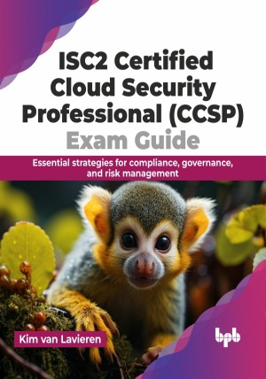

# ISC2 Certified Cloud Security Professional (CCSP) Exam Guide

Take your career to the next level by becoming an ISC2 certified cloud security professional (CCSP)

This is the repository for [ISC2 Certified Cloud Security Professional (CCSP) Exam Guide
](https://bpbonline.com/products/isc2-certified-cloud-security-professional-ccsp-exam-guide?variant=43230083940552),published by BPB Publications.

## About the Book
Cloud security is a rapidly evolving field, demanding professionals with specialized knowledge and expertise. This book equips you with the foundational understanding and practical skills necessary to excel in this critical domain, preparing you to confidently pass the CCSP exam.

Discover cloud computing basics, security, and risk management in this book. Learn about data security intricacies, infrastructure protection, and secure configuration. Proactively manage risks with vulnerability assessments, threat mitigation, and incident response. Understand legal and privacy considerations, including international regulations. Dive into identity and access management using tools like SSO and CASBs. Explore cloud application architecture, incorporating security tools like WAFs and API gateways. Get ready for certifications like CCSP with dedicated exam preparation sections. 

Arm yourself with the knowledge and practical skills cultivated throughout this guide. Confidently navigate the ever-evolving landscape, tackle real-world challenges, and stand out as a CCSP certified professional.

## What You Will Learn
• You will learn about cloud concepts, secure architectures, and secure design.

• You will learn how to secure data, applications, and infrastructure in the cloud.

• Understand data residency and legal considerations for cloud data storage.

• Implement risk management frameworks for cloud environments.

• You will learn to navigate laws and regulations, manage risk, and ensure compliance.
